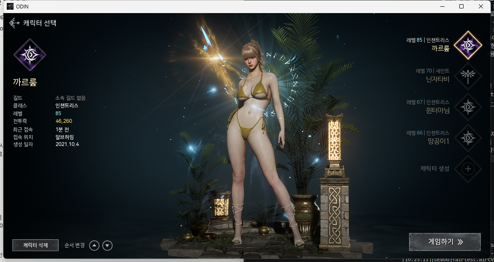
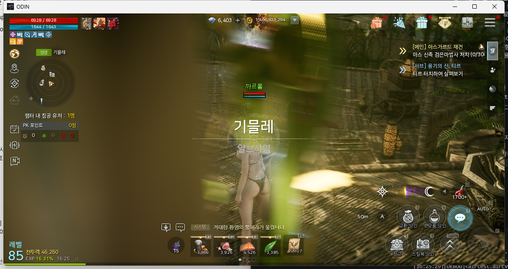

# 오딘: 발할라 라이징 QA 자동화

모바일 MMORPG QA 경력을 바탕으로 만든 개인 프로젝트입니다. 오딘: 발할라 라이징 PC 클라이언트를
대상으로 "실행 → 스플래시 통과 → 캐릭터 선택 → 게임하기 → 인게임 진입" 흐름(스모크 테스트)과
인게임 상단 메뉴 5개의 진입/복귀를 자동으로 확인하고, 결과를 HTML 리포트와 Google Sheets에
남깁니다.

> **안내:** 본인 계정으로 클라이언트가 정상 실행되는지 확인하는 QA 학습/포트폴리오 목적의
> 프로젝트입니다. 사냥, 재화 획득 같은 실제 플레이를 자동화하거나 배포하려는 목적이 아닙니다.

## 배경

- QA 실무에서 빌드가 나올 때마다 반복하던 스모크 테스트를 자동화해 보고 싶었습니다.
- 안드로이드 단말기가 없어 PC 클라이언트를 대상으로 구현했습니다.
- 오딘은 웹사이트에서 로그인한 뒤 클라이언트를 실행하는 구조라 클라이언트 안에 로그인 화면이
  없습니다. 웹 로그인까지 자동화하면 계정 비밀번호를 스크립트에 넣어야 해서 범위에서 제외하고,
  로그인이 끝난 상태에서 클라이언트가 정상 실행되는지를 검증 대상으로 잡았습니다.
- 캐릭터 선택 화면에서는 특정 캐릭터를 이미지로 찾을 필요가 없었습니다. "게임하기" 버튼이
  캐릭터 목록과 상관없이 항상 같은 자리에 있어서, 이 버튼만 기준으로 다음 단계로 넘어갈 수
  있었고 덕분에 불필요한 이미지 탐색 없이 인게임 진입까지 흐름을 단순하게 가져갈 수 있었습니다.

## 기술 스택

- Python 3.12
- Airtest — 이미지 템플릿 매칭으로 게임 화면을 인식하는 자동화 프레임워크
- pywin32 — 스크린샷을 찍기 전에 오딘 창을 맨 앞으로 가져오는 Windows API 호출
- Google Apps Script — 테스트 실행 결과를 Google Sheets에 자동 기록
- AirtestIDE — 템플릿 이미지를 캡처하고 매칭을 확인할 때 사용. 테스트 실행에는 필요 없음

## 동작 방식

1. 실행 중인 오딘 PC 클라이언트 창에 연결합니다.
2. 스플래시 화면을 인식하고 클릭해 넘깁니다. 로딩 중에는 클릭이 씹히는 경우가 있어, 화면이
   실제로 바뀔 때까지 반복해서 클릭합니다.
3. 캐릭터 선택 화면에 들어왔는지를 화면 제목처럼 항상 고정으로 표시되는 UI로 확인합니다.
   캐릭터 초상화처럼 계정마다 달라지는 요소는 템플릿으로 쓰지 않아, 어떤 계정으로 돌려도 같은
   결과가 나오도록 했습니다.
4. "게임하기" 버튼을 클릭합니다. 버튼 위치가 고정이라 특정 캐릭터를 고를 필요가 없습니다.
5. 인게임에 들어왔는지를 서로 다른 위치에 있는 두 UI 요소, **HP/MP 바 왼쪽 끝**과 **상단
   메뉴(BM 상점 아이콘 등)** 로 판정합니다. 둘 중 하나만 보고 판단하면 다른 화면의 비슷한
   아이콘을 인게임으로 잘못 인식할 수 있어, 두 템플릿이 **모두** 매칭될 때만 성공으로 봅니다.
   HP/MP 바는 불투명한 단색이라 캐릭터가 어디에 서 있든 같은 모습이고, 숫자가 시작되기 전
   구간만 잘라 값이 바뀌어도 영향이 없습니다. 처음에 후보로 봤던 하단 상점 아이콘(위치에 따라
   바뀜)과 "레벨" 라벨(반투명이라 바닥 색에 따라 매칭이 흔들림)은 제외했습니다.
6. 단계마다 오딘 창을 맨 앞으로 가져온 뒤 스크린샷을 찍습니다. 다른 창이 겹쳐 찍히는 걸 막기
   위해서입니다.
7. 성공/실패와 상관없이 직접 만든 리포터로 단계별 스크린샷이 담긴 HTML 리포트를 생성합니다.
8. 실행 결과 한 줄(시각, 시나리오, PASS/FAIL, 소요시간, 실패 단계, 실패 사유)을 Google Sheets에
   기록합니다. 시트 설정이 없으면 이 단계만 건너뜁니다.

## 테스트 시나리오

| 이름 | 검증 내용 | 사전 조건 |
|---|---|---|
| `smoke` | 스플래시 통과 → 캐릭터 선택 → 게임하기 → 인게임 진입 | 스플래시 화면 |
| `top_menu` | 상단 메뉴 5개(이벤트, 선물, BM 상점, 가방, 메뉴)를 하나씩 열고 ESC로 닫아, 각 메뉴 화면이 뜨고 HUD로 돌아오는지 확인 | 인게임 (아니면 자동 진입) |

시나리오는 `scenarios/` 아래 한 파일이고, 연결·스크린샷·리포트·시트 기록은 `core/`가 맡습니다.
메뉴 테스트는 항목별로 결과를 남겨서, 한 메뉴가 실패해도 나머지는 계속 확인합니다. 메뉴 화면
"열림" 판정에는 이벤트 배너나 상품처럼 바뀌는 내용이 아니라 화면 제목 같은 고정 틀만 씁니다.

실패는 네 단계로 구분해 기록합니다: **실행 준비**(오딘 창 없음/중복, 관리자 권한 아님) ·
**사전 조건**(메뉴 테스트인데 인게임 진입 실패) · **조작**(아이콘을 못 찾음) · **화면 확인**(눌렀는데
기대한 화면이 아님).

## 스크린샷

|캐릭터 선택 화면 진입 확인|인게임 진입 확인|
|---|---|
|||

## 실행 방법

### 사전 준비

- Windows + Python 3.12 (3.13은 Airtest 의존성 문제로 설치가 안 됩니다. 아래 "구현 중 발견한
  문제" 참고)
- 오딘 PC 클라이언트를 웹 로그인까지 마친 뒤 실행해서, **스플래시 화면이 떠 있는 상태**로 둡니다.

```
py -3.12 -m venv venv
venv\Scripts\activate
pip install -r requirements.txt
```

코드를 고칠 때는 `pip install -r requirements-dev.txt` 후 `python -m pytest`로, 게임 없이 돌아가는
단위 테스트(오류 분류, 항목별 결과 집계, 시트 전송 판정, 진입/메뉴 플로우 분기)를 확인할 수 있습니다.

### 실행

오딘은 안티치트 때문에 관리자 권한으로 실행됩니다. 그래서 아래 명령어도 **관리자 권한 터미널**에서
실행해야 합니다. 일반 권한으로 실행하면 Windows 권한 격리(UIPI)에 막혀, 에러 메시지도 없이
마우스 클릭만 무시됩니다.

```
venv\Scripts\activate
cd odin_qa
python run.py smoke        # 스모크 테스트
python run.py top_menu     # 상단 메뉴 테스트 (인게임이 아니면 자동으로 진입)
python run.py all          # 전부 순서대로
```

테스트가 끝나면 `odin_qa/log/<시나리오>_report.html`에서 결과를 확인할 수 있습니다. 실패한
경우에도 실패 시점의 스크린샷이 포함된 리포트가 생성되며, 이때 종료 코드가 0이 아니라 스케줄러나
CI에서 실패를 감지할 수 있습니다. `all`에서는 한 번 연결로 시나리오를 이어서 돌리므로, 스모크가
인게임까지 들어가면 메뉴 테스트는 진입 없이 바로 시작합니다. 스모크가 실패하면 뒤 시나리오는
실행하지 않고 "사전 조건" 실패로 기록합니다.

## 실행 이력 관리 (Google Sheets 연동)

테스트를 실행할 때마다 결과(시각, 시나리오, PASS/FAIL, 소요시간, 실패 단계, 실패 사유)가 Google
Sheets에 한 줄씩 쌓입니다. 시나리오가 여럿이어도 한 시트에 모아 두고, 필요하면 시나리오 컬럼으로
필터합니다. HTML 리포트를 하나씩 열어보지 않아도, 시트만 보면 최근에 몇 번 돌렸고 몇 번 통과했는지
바로 파악할 수 있습니다.

**실행 예시 시트**: https://docs.google.com/spreadsheets/d/1RNdHReJAfhZ5iX_mJwGQQOS6u0UJa835ScSjB9uwOnQ/edit?usp=sharing

### 설정 방법 (선택)

설정하지 않으면 시트 기록만 건너뛰고, 테스트와 HTML 리포트는 그대로 동작합니다.

1. 새 Google Sheets를 만들고 `확장 프로그램 > Apps Script`에
   [docs/google_apps_script.js](docs/google_apps_script.js) 내용을 붙여넣습니다.
   `배포 > 새 배포 > 웹 앱` (실행: 나, 액세스: 모든 사용자)으로 배포하면 URL이 나옵니다.
   이 URL을 브라우저로 열어 `{"status":"ok"}`가 보이면 배포가 된 것입니다.
2. `odin_qa/sheets_config.example.py`를 `sheets_config.py`로 복사하고 위 URL을 넣습니다.
   `sheets_config.py`는 `.gitignore`에 등록되어 있어 커밋되지 않습니다.
3. 선택: URL만 알면 누구나 행을 추가할 수 있어서, Apps Script의 `TOKEN`과 `sheets_config.py`의
   `WEBHOOK_TOKEN`에 같은 문자열을 넣어두면 토큰이 일치하는 요청만 기록됩니다.

전송 성공 여부는 HTTP 상태 코드가 아니라 Apps Script가 돌려주는 JSON(`status: ok`)으로
판단합니다. 배포 권한이 잘못되면 구글 로그인 페이지가 200으로 돌아오는데, 이 경우를 성공으로
잘못 처리하지 않기 위해서입니다.

## 구현 중 발견한 문제와 해결

실제 서비스 중인 게임을 대상으로 하다 보니, 튜토리얼 예제로는 만나지 못했을 문제들을 겪었습니다.

- **Python 3.13 호환성**: Airtest가 의존하는 numpy 구버전이 3.13용 사전 빌드 파일을 제공하지
  않아 설치가 실패했습니다. → Python 3.12로 전환
- **관리자 권한**: 오딘이 안티치트 때문에 관리자 권한으로 실행되어, 일반 권한 스크립트의 마우스
  클릭이 Windows 권한 격리(UIPI)에 막혀 에러도 없이 무시됐습니다. → 자동화 스크립트도 관리자
  권한 터미널에서 실행
- **로딩 화면에서 클릭이 씹힘**: 같은 로고 이미지가 로딩 중에도 잠깐 보여서, 그 타이밍에
  클릭하면 다음 화면으로 넘어가지 않았습니다. → 화면이 실제로 바뀔 때까지 반복 클릭하도록 수정
- **계정 상태 의존성**: 캐릭터 선택 화면은 계정마다 보유 캐릭터가 달라 보이는 내용이 다릅니다.
  → 캐릭터 초상화 대신 항상 고정으로 표시되는 화면 제목만 템플릿으로 사용해 재현성 확보
- **위치에 따라 바뀌는 인게임 UI**: 인게임 판정용으로 잡았던 하단 상점 아이콘(교환 상인/소모품
  상인)이 사냥터에서는 스킬 아이콘으로 바뀌는 걸 확인했습니다. → 위치와 무관하게 항상 고정인
  요소만 템플릿으로 사용
- **반투명 HUD는 배경을 탄다**: 그다음 앵커로 쓴 "레벨" 라벨은 위치가 고정이지만 반투명이라
  게임 월드가 비쳐 보입니다. 나무 바닥에서 캡처한 템플릿이 모래 바닥에서는 신뢰도 0.65로
  떨어져 판정이 깨졌습니다(기준 0.7). 글자만 남게 잘라도 0.4 수준이었습니다. → 불투명한 단색인
  HP/MP 바 왼쪽 끝으로 교체 (다른 위치에서 0.94, 캐릭터 선택 화면에서는 0.24로 오탐 없음)
- **오딘 중복 실행**: 클라이언트를 두 번 켠 상태에서 창 제목이 같은 창이 둘이라 연결이 실패했고,
  원문 에러가 영어라 원인을 바로 알기 어려웠습니다. → 연결 전에 창 개수를 세서 한글로 안내하고,
  라이브러리 예외도 한글 설명으로 바꿔 리포트와 시트에 기록

## 프로젝트 구조

```
QA_AI/
├── odin_qa/
│   ├── run.py                      # 진입점: python run.py smoke | top_menu | all
│   ├── core/
│   │   ├── client.py               # 오딘 창 찾기·연결·스크린샷·템플릿 로드
│   │   ├── flows.py                # 재사용 플로우: 스플래시 통과, 인게임 진입, 메뉴 열기/닫기
│   │   ├── context.py              # 시나리오 1회 실행의 단계·항목·결과 기록
│   │   ├── errors.py               # 실패 단계 구분, 라이브러리 예외 한글화
│   │   ├── reporter.py             # HTML 리포트 생성
│   │   └── sheets.py               # Google Sheets 전송
│   ├── scenarios/
│   │   ├── smoke.py                # 스모크 테스트
│   │   └── top_menu.py             # 상단 메뉴 테스트 (MENUS 표에 항목 추가로 확장)
│   ├── templates/                  # 화면 인식용 템플릿 이미지 (common/, top_menu/)
│   ├── tools/                      # 템플릿 제작용 캡처/크롭 도구
│   ├── sheets_config.example.py    # Google Sheets 웹훅 설정 예시 (복사해서 sheets_config.py로)
│   └── log/                        # 실행 시 자동 생성 (스크린샷, <시나리오>_report.html)
├── tests/                          # 게임 없이 도는 단위 테스트 (pytest)
├── docs/
│   ├── google_apps_script.js       # Google Sheets에 붙여넣는 Apps Script 코드
│   ├── screenshots/                # README용 스크린샷
│   └── design/                     # 설계 문서
├── requirements.txt
└── requirements-dev.txt
```

## 설계 문서

- [스모크 테스트 설계](docs/design/2026-09-15-odin-qa-automation-design.md) — 왜 Airtest인지, 템플릿을
  어떻게 골랐는지, 구현하며 바뀐 결정들
- [시나리오 확장 구조와 상단 메뉴 테스트 설계](docs/design/2026-09-21-scenario-framework-and-top-menu-design.md)
  — 공통 모듈/시나리오 분리, 사전 조건 자동 진입, 실패 단계 구분

## 향후 확장 계획

지금의 연결·리포팅 구조를 그대로 재사용하면서, 같은 오딘 프로젝트 안에서 테스트 시나리오를
하나씩 늘려갈 계획입니다. 다른 게임이나 플랫폼은 별도 프로젝트로 분리합니다.

- 햄버거 메뉴 안의 항목(캐릭터 정보, 스킬북, 설정 등 약 20개)으로 메뉴 테스트 확장 — `MENUS`
  표에 항목과 템플릿만 추가
- 이미지 비교 기반 UI 회귀 테스트
- 다른 게임/플랫폼으로 확장 (별도 프로젝트)
